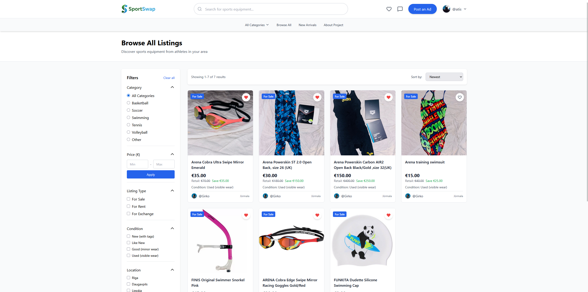
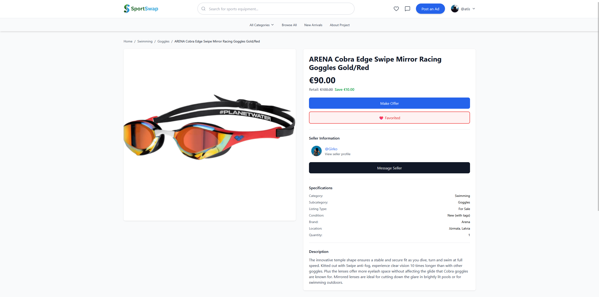
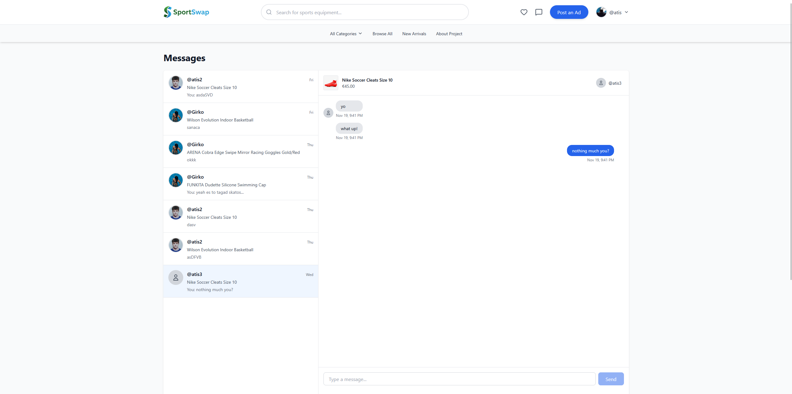
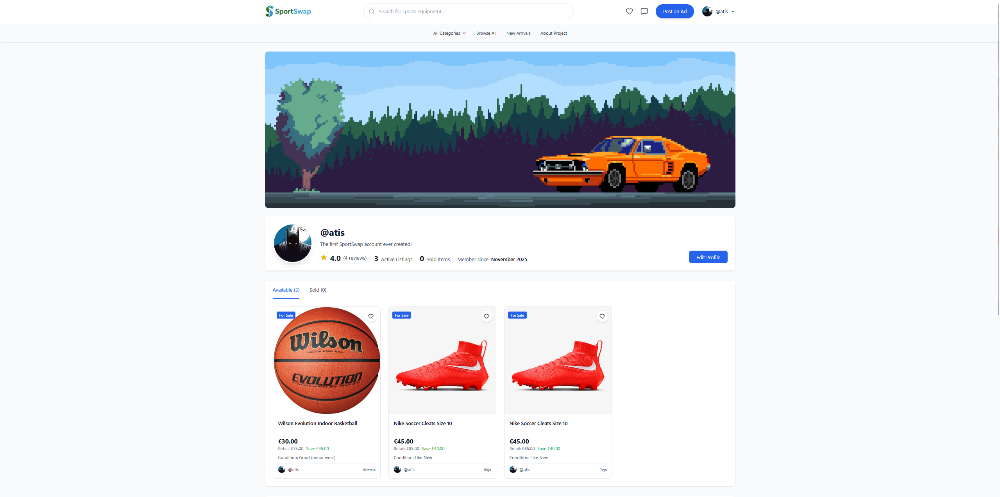
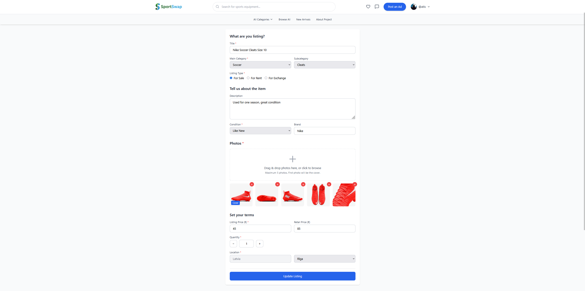
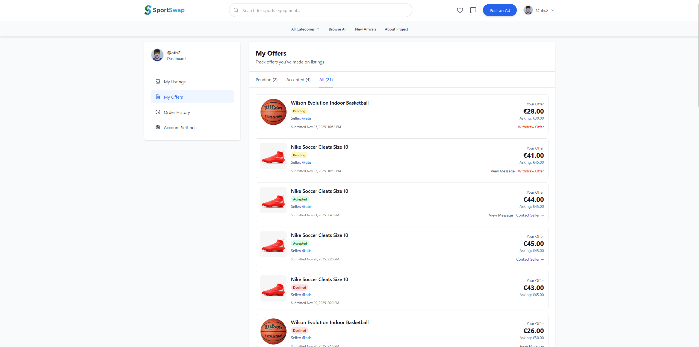
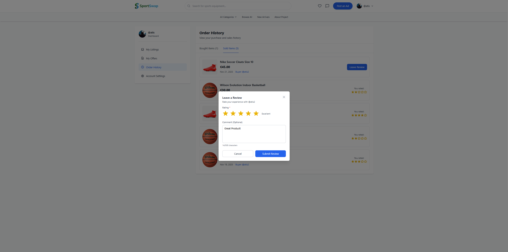

<div align="center">
  

  <p align="center">A modern, full-featured marketplace for buying and selling sports equipment. Built with React, Vite, and Supabase.</p>

  <p align="center">
    
    
    
    
  </p>
</div>

## Table of Contents

- [Overview](#overview)
- [Features](#features)
- [Tech Stack](#tech-stack)
- [Screenshots](#screenshots)
- [Getting Started](#getting-started)
- [Database Schema](#database-schema)
- [Security Features](#security-features)
- [Educational Purpose](#educational-purpose)
- [Contributing](#contributing)
- [License](#license)

## Overview

SportSwap is a comprehensive peer-to-peer marketplace designed specifically for sports enthusiasts to buy, sell, and trade sports equipment. The platform features real-time messaging, offer negotiation, user reviews, and a seamless transaction system.

## Features

### Authentication & User Management
- Secure user registration and login with email/password
- Protected routes and session management
- User profile creation and customization
- Profile pictures and cover photos
- Bio and personal information

### Listings & Browse System
- Create detailed listings with multiple images
- Image upload and management
- Category and subcategory filtering
- Advanced search functionality
- Condition tracking (New, Like New, Good, Fair, Poor)
- Location-based listings
- Draft and published listing states
- Edit and delete listings

### Real-Time Messaging
- Direct messaging between buyers and sellers
- Real-time message updates with Supabase subscriptions
- Conversation threads linked to specific listings
- Unread message indicators
- Message history and timestamps

### Offers & Transactions
- Make offers on listings
- Counter-offer functionality
- Accept/decline offer system
- Automatic transaction creation on acceptance
- Offer status tracking (Pending, Accepted, Declined, Withdrawn)
- Optional offer messages
- Mark listings as sold

### Review & Reputation System
- Rate buyers and sellers after transactions
- 5-star rating system with comments
- Average rating display on profiles
- Recent reviews section
- Order history (bought and sold items)
- One review per transaction policy

### User Experience
- Responsive mobile-first design
- Professional confirmation modals
- Toast notifications
- Loading states and error handling
- Collapsible sections
- Real-time search
- Favorites system
- Dashboard with quick stats

## Tech Stack

### Frontend
- **React 18.3.1** - UI library with hooks and functional components
- **Vite 6.0.1** - Lightning-fast build tool and dev server
- **React Router 7.9.6** - Client-side routing and navigation
- **Tailwind CSS 3.4.17** - Utility-first CSS framework
- **Framer Motion** - Smooth animations and transitions
- **Lucide React** - Modern icon library

### Backend
- **Supabase** - Backend as a Service
  - PostgreSQL database
  - Real-time subscriptions
  - Row Level Security (RLS)
  - Storage for images
  - Authentication & Authorization

### Hosting & Deployment
- **Vercel** - Frontend hosting with automatic deployments
- **Supabase Cloud** - Database and backend hosting

## Screenshots

### Homepage


### Browse Listings


### Listing Detail


### Real-Time Messaging


### User Profile


### Create Listing


### Offers & Transactions


### Review System


## Getting Started

### Prerequisites
- Node.js 18+ and npm
- Supabase account ([Sign up here](https://supabase.com))

### Installation

1. **Clone the repository**
   ```bash
   git clone https://github.com/s1dolab/SportSwap.git
   cd SportSwap
   ```

2. **Install dependencies**
   ```bash
   npm install
   ```

3. **Set up environment variables**

   Create a `.env` file in the root directory:
   ```bash
   cp .env.example .env
   ```

   Then edit `.env` and add your Supabase credentials:
   ```env
   VITE_SUPABASE_URL=your_supabase_project_url
   VITE_SUPABASE_ANON_KEY=your_supabase_anon_key
   ```

4. **Set up the database**

   - Navigate to your Supabase project dashboard
   - Go to SQL Editor
   - Copy the contents of `/database/00_schema.sql`
   - Paste and execute in the SQL Editor
   - Create two storage buckets: `profile-pictures` and `listing-images` (public access)

   See `/database/README.md` for detailed setup instructions.

5. **Start the development server**
   ```bash
   npm run dev
   ```

6. **Open your browser**

   Navigate to `http://localhost:5173`

## Database Schema

### Main Tables
- **profiles** - User profile information extending Supabase auth
- **listings** - Product listings with category, condition, and price details
- **listing_images** - Multiple images per listing with ordering
- **conversations** - Chat threads between buyers and sellers
- **messages** - Individual messages with read status
- **offers** - Price negotiation offers with status tracking
- **transactions** - Completed sales records
- **reviews** - User ratings and feedback (1-5 stars)
- **favorites** - User's saved listings

### Key Features
- **Row Level Security (RLS)** on all tables
- **Indexes** for optimized query performance
- **Triggers** for automatic timestamp updates
- **Foreign keys** maintaining data integrity
- **Check constraints** ensuring data validity

For complete schema and setup instructions, see [`/database/README.md`](./database/README.md)

## Security Features

- **Row Level Security (RLS)** on all database tables
- Authentication required for sensitive operations
- Secure image upload with Supabase Storage
- Environment variables for sensitive configuration
- SQL injection prevention through Supabase client
- XSS protection with React's built-in escaping
- Protected routes requiring authentication
- User can only modify their own data

## Educational Purpose

This project was developed as a comprehensive full-stack web application demonstration, showcasing:
- Modern React patterns and hooks (useState, useEffect, useContext)
- Real-time functionality with WebSockets/Supabase Realtime
- Database design and relational data modeling
- User authentication and authorization with RLS
- RESTful API integration through Supabase client
- Responsive web design with Tailwind CSS
- State management with React Context
- File upload handling and image optimization
- Complex UI components and modals
- Form validation and error handling

## Contributing

Contributions, issues, and feature requests are welcome! Feel free to check the [issues page](https://github.com/s1dolab/SportSwap/issues).

## License

This project is open source and available under the [MIT License](LICENSE).

## Authors

**s1dolab**
- GitHub: [@s1dolab](https://github.com/s1dolab)

## Acknowledgments

- [Supabase](https://supabase.com) for the amazing backend platform
- [Tailwind CSS](https://tailwindcss.com) for the utility-first CSS framework
- [React](https://react.dev) team for the powerful UI library
- [Vite](https://vitejs.dev) for the lightning-fast build tool
- [Framer Motion](https://www.framer.com/motion/) for smooth animations
- [Lucide](https://lucide.dev) for beautiful icons
